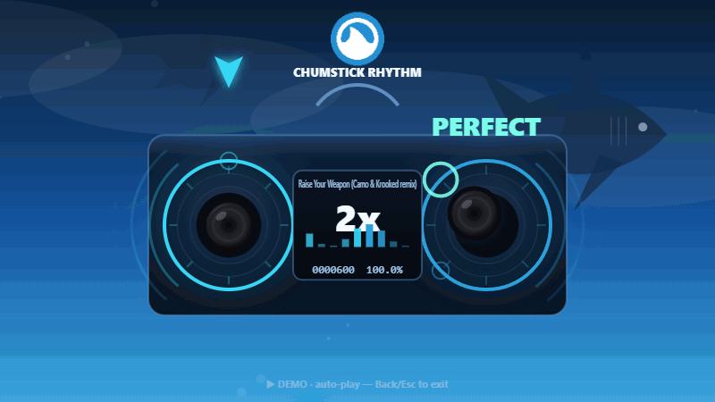

# 🦈 CHUMSTICK RHYTHM

> A **dual-analog-stick rhythm game** for the DualSense / DualShock — a play on *thumbstick*
> rhythm. It's a front-facing **stereo**: two speakers, each with a real analog **thumbstick in
> the centre**. Each stick is an **absolute cursor inside a disc**, so it's about **flow, not
> taps**: *be on* a note as it crosses, **trace the lines** that sweep around the rim, and **spin**
> to fill a gauge. Keep up and the song plays clean — **slip and the audio glitches**, Guitar-Hero
> style. Grooveshark-blue, with a shark cruising the sky. Pure **Web Audio + Canvas**, no plugins,
> runs in a browser tab.

<p align="center">
  
</p>

<p align="center"><sub>Auto-play demo: notes ride in around the speakers, the on-screen <b>thumbsticks flick to hit them</b>, combo climbs — and a shark cruises behind.</sub></p>

---

## What it is

Most rhythm games are about *buttons*. This one is about the **sticks** — and it reads the stick
as what it physically is: an **absolute analog position** inside a disc. So scoring is
**continuous and presence-based**, judged every frame, not a discrete press. Four note types:

- **be-there taps** — be in the note's arc *as it crosses*; no timed press.
- **holds** — park the stick in the arc and keep it there.
- **slides** — a target sweeps along the rim; **trace the line** with the stick (the staple).
- **spinners** — *rotate* the stick to fill a gauge (osu-style).

Two hands, two speakers, near-continuous motion. The clever bit is the audio: the track just
**plays through**. Keep up and it stays clean — **slip and the mix stutters, pitch-bends and
buzzes** for a beat. The song is the reward and the punishment.

> Why it's new: flow aiming, directional rhythm (DDR), spinners/sliders (osu, maimai), and
> two-handed hits (Beat Saber) all exist — but nobody's made a rhythm game whose **core input is
> flowing two analog sticks** along lines and arcs. See [`DESIGN.md`](DESIGN.md) for the notes.

---

## Play it

It needs a real `http://` origin (Gamepad API + ES modules), so serve the folder:

```bash
python -m http.server 8000      # …or:  npx serve .
```

Open **http://localhost:8000**, then:

1. **Click** once to enable sound.
2. Plug in / pair a **DualSense** and **press a button to wake it** — browsers hide a gamepad
   until you do. The splash is a live **controller tester**: move the sticks and watch them on the
   speakers; the L2/R2 bars fill as you pull the triggers.
3. **Pull L2 + R2 together to start.**

> Just want to watch? Hit **▶ watch demo** for an attract-mode auto-play (that's the GIF above).

**Controller required** — the game needs real analog sticks you can flick and *flow*; the keyboard
only confirms/cancels menus.

### Controls
| Input | Action |
| --- | --- |
| **Left stick** | Ride **left-speaker** notes — point into the note's **arc** (a forgiving range, not an exact spot) |
| **Right stick** | Ride **right-speaker** notes |
| **Taps** | Just *be in the arc* as the note crosses — no timed press |
| **Holds** | Park the stick in the arc and keep it there |
| **Slides** | Trace the moving line as it sweeps around the rim |
| **Spinners** | Rotate the stick to fill the gauge |
| **L1 / R1 / face buttons** | Held for **modifier** notes |
| **L2 + R2** | Start (on the splash) |
| **Options / ✕** confirm · **◯ / Esc** | back / pause |

---

## Bring your own music

From **browse songs → Load custom**:

- **Audio + beatmap** — drop a local audio file (`.mp3/.ogg/.wav`) and a matching `.json` chart.
- **Audio + auto-chart** — drop *just* an audio file; it runs onset/BPM detection to generate a
  starter chart you can play immediately and **download to hand-tune**.

Nothing's uploaded — it all stays in your browser.

### Beatmap format
Plain JSON (full spec in [`DESIGN.md`](DESIGN.md#5-beatmap-format)):

```jsonc
{
  "meta": {
    "title": "…", "artist": "…",
    "audio": "raise-your-weapon.mp3",   // file expected in assets/ (optional)
    "bpm": 175, "offset": 0.0,           // offset seconds added to every note time
    "approachTime": 2.4,                  // seconds a note is visible before its hit
    "difficulty": "Onset"
  },
  "notes": [
    { "time": 2.13, "ring": "L", "angle": 300 },                      // tap: be in the arc
    { "time": 3.20, "ring": "R", "angle": 90, "mod": "L1" },          // tap + held modifier
    { "time": 7.55, "ring": "L", "angle": 188, "hold": 0.46 },        // hold: park & keep
    { "time": 9.10, "ring": "R", "angle": 0, "to": 180, "hold": 0.9 },// slide: trace 0°→180°
    { "time": 12.4, "ring": "L", "angle": 0, "spin": 2, "hold": 1.4 } // spinner: 2 rotations
  ]
}
```

- `ring` — `"L"` or `"R"`
- `angle` — degrees, **0 = right, 90 = down, 180 = left, 270 = up** (continuous; ride within a
  forgiving arc). *Legacy:* a named `dir` (`up/down/left/right/+diagonals`) still works.
- `hold` *(optional)* — seconds to keep the stick in the arc (a **hold**)
- `to` *(optional)* — slide end heading in degrees; the target sweeps `angle → to` over `hold`
  (a **slide** — the line you trace)
- `spin` *(optional)* — full rotations to clear a **spinner** (needs a `hold` span; defaults ~1.2s)
- `mod` *(optional)* — `L1 · R1 · L2 · R2 · cross · circle · square · triangle`

---

## Base song — "Raise Your Weapon (Camo & Krooked remix)"

The bundled chart is built around this track. **The audio isn't included** (copyright). Drop your
own file in as `assets/raise-your-weapon.mp3` and it plays. Until then there's a **synth groove**
(kick/hat/snare/bass) locked to the chart's BPM so the game is fully playable. The included chart
was generated from the real song's **onsets**, so notes land on the actual beats.

---

## How it's built

Vanilla **JavaScript + HTML5 Canvas + Web Audio API** — no framework, no build step, near-zero
deps. Timing is driven entirely off `AudioContext.currentTime` (never `setTimeout`) for
sample-accurate sync. Input is the **Gamepad API**, polled once per frame; scoring is
**frame-driven and presence-based** (be-on-it / trace / spin), not a discrete press. OBS-overlay
friendly.

```
index.html · styles.css
src/        ES modules — audio (clock + groove + glitch), input (gamepad position),
            chart (note types + target math), scoring (presence/coverage), render (the stereo +
            stick trail), beatgen (auto-charting), main
beatmaps/   committed chart JSON (no audio)
scripts/    flowify (base-chart builder) + headless node tests (sim, render smoke)
brand/      the chum logo
assets/     drop local audio here (gitignored)
```

## Credits
- Brand mark is the **chum / Grooveshark** logo used across [brendanwelsh](https://github.com/brendanwelsh)'s projects.
- Base track used with permission; **not distributed** here.
